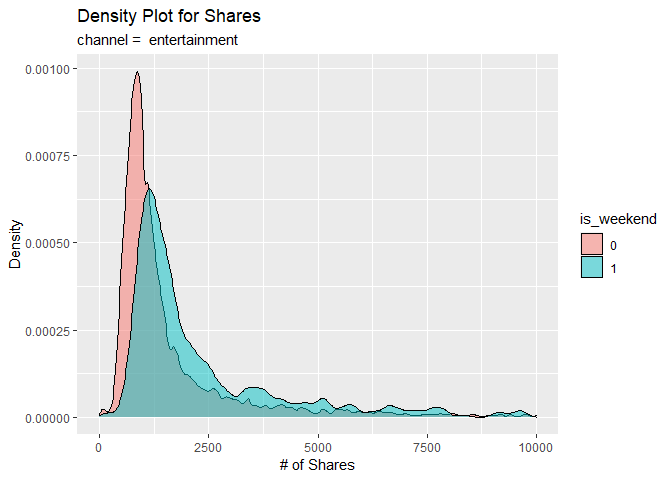
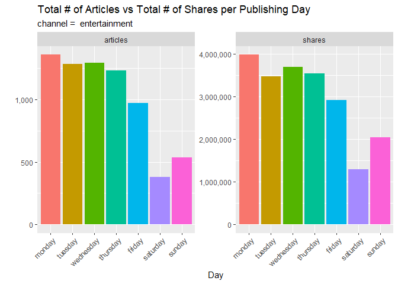
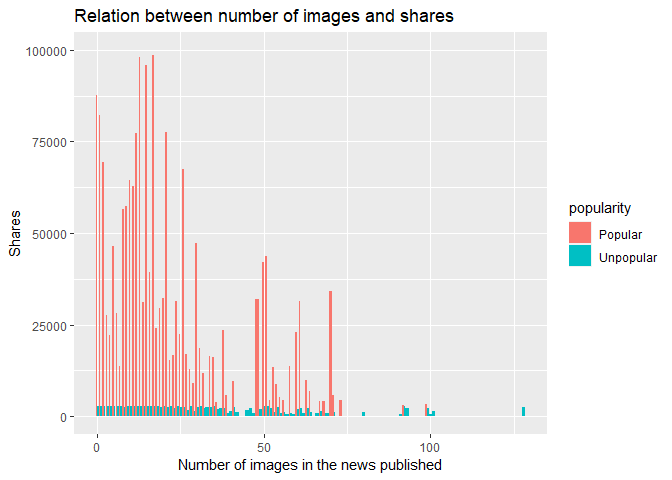
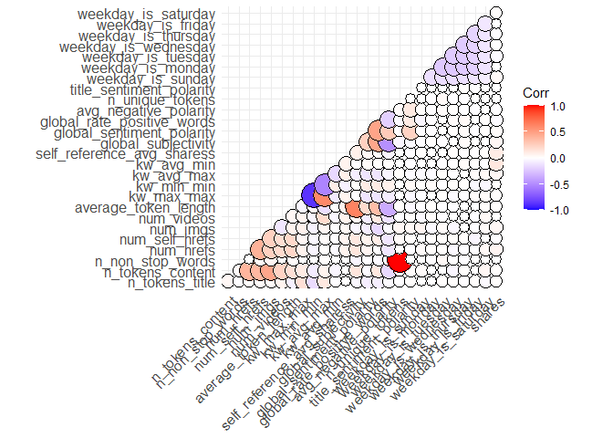
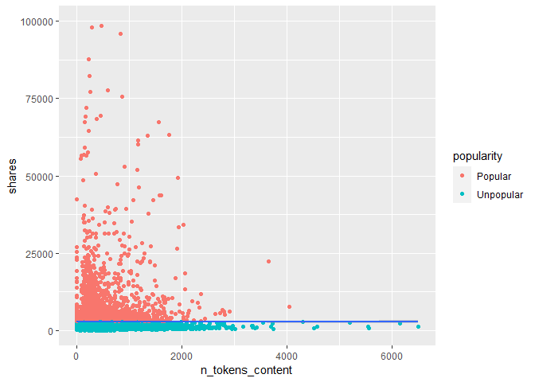

ST 558 Project 3: Entertainment Analysis Report
================
Suyog Dharmadhikari; Bennett McAuley
2022-11-02

## Introduction

The goal of this report is to create and compare predictive models using
[Online News
Popularity](https://archive.ics.uci.edu/ml/datasets/Online+News+Popularity)
data from the UCI Machine Learning Repository.

This data contains information about articles published by Mashable over
a period of two years–specifically the statistics associated with them.

The purpose of this analysis is to use linear regression and ensemble
tree-based methods to predict the number of `shares`–our target
variable–subset by data channel. For more details about these methods,
see the *Modeling* section.

According to the data description, there are 39,797 observations and 61
variables present. 58 of them are predictors, but using all of them
would be inefficient and show glaring redundancies. Instead, the ones
that will be used were chosen intuitively–what might encourage a user to
share an article, what underlying forces may influence them, and what
would make for good exploratory analysis:

1.  `average_token_length` - Average length of the words in the content
2.  `avg_negative_polarity` - Avg. polarity of negative words
3.  `global_rate_positive_words` - Rate of positive words in the content
4.  `global_sentiment_polarity` - Text sentiment polarity
5.  `global_subjectivity` - Text subjectivity
6.  `is_weekend` - Was the article published on the weekend?
7.  `kw_avg_max` - Best keyword (avg. shares)
8.  `kw_avg_min` - Worst Keyword (avg. shares)
9.  `kw_max_max` - Best keyword (max shares)
10. `kw_min_min` - Worst keyword (min shares)
11. `n_non_stop_words` - Rate of non-stop words in the content
12. `n_tokens_content` - Number of words in the content
13. `n_tokens_title` - Number of words in the title
14. `n_unique_tokens` - Rate of unique words in the content
15. `num_hrefs` - Number of links
16. `num_imgs` - Number of images
17. `num_self_hrefs` - Number of links to other articles published by
    Mashable
18. `num_videos` - Number of videos
19. `self_reference_avg_shares` - Avg. shares of referenced articles in
    Mashable
20. `title_sentiment_polarity` - Title polarity
21. `weekday_is_monday` - Was the article published on a Monday?
22. `weekday_is_tuesday` - Was the article published on a Tuesday?
23. `weekday_is_wednesday` - Was the article published on a Wednesday?
24. `weekday_is_thursday` - Was the article published on a Thursday?
25. `weekday_is_friday` - Was the article published on a Friday?
26. `weekday_is_saturday` - Was the article published on a Saturday?
27. `weekday_is_sunday` - Was the article published on a Sunday?

Which we store in a vector for fast retrieval:

``` r
news.vars <- c('n_tokens_title', 'n_tokens_content', 'n_non_stop_words', 'num_hrefs',
               'num_self_hrefs', 'num_imgs', 'num_videos', 'average_token_length',
               'kw_max_max', 'kw_min_min', 'kw_avg_max', 'kw_avg_min',
               'self_reference_avg_sharess','is_weekend', 'global_subjectivity', 'global_sentiment_polarity',
               'global_rate_positive_words', 'avg_negative_polarity', 'n_unique_tokens', 'title_sentiment_polarity',
               'weekday_is_sunday', 'weekday_is_monday', 'weekday_is_tuesday', 'weekday_is_wednesday',
               'weekday_is_thursday', 'weekday_is_friday', 'weekday_is_saturday'
               )
```

## The Data

For this analysis, we will consider a single source for the data
channel. In other words, we subset the data to the *Entertainment*
channel.

So, we read in the data, perform the filter, and convert `is_weekend`
into a binary factor:

``` r
news <- read_csv("OnlineNewsPopularity.csv")
```

    ## Rows: 39644 Columns: 61
    ## ── Column specification ───────────────────────────────────────────────────────────────────────────
    ## Delimiter: ","
    ## chr  (1): url
    ## dbl (60): timedelta, n_tokens_title, n_tokens_content, n_unique_tokens, n_non_stop_words, n_non...
    ## 
    ## ℹ Use `spec()` to retrieve the full column specification for this data.
    ## ℹ Specify the column types or set `show_col_types = FALSE` to quiet this message.

``` r
fltr <- paste0("data_channel_is_", params$channel)

news.tbl <- news %>% filter(get(fltr) == 1) %>% 
  select(all_of(news.vars), shares) %>%
  mutate(is_weekend = as.factor(is_weekend))

head(news.tbl)
```

    ## # A tibble: 6 × 28
    ##   n_token…¹ n_tok…² n_non…³ num_h…⁴ num_s…⁵ num_i…⁶ num_v…⁷ avera…⁸ kw_ma…⁹ kw_mi…˟ kw_av…˟ kw_av…˟
    ##       <dbl>   <dbl>   <dbl>   <dbl>   <dbl>   <dbl>   <dbl>   <dbl>   <dbl>   <dbl>   <dbl>   <dbl>
    ## 1        12     219    1.00       4       2       1       0    4.68       0       0       0       0
    ## 2         9     531    1.00       9       0       1       0    4.40       0       0       0       0
    ## 3        14     194    1.00       4       4       0       1    4.52       0       0       0       0
    ## 4        12     161    1.00       5       4       0       6    4.45       0       0       0       0
    ## 5        11     454    1.00       5       3       1       0    4.89       0       0       0       0
    ## 6        12     177    1.00       4       3       1       0    5.06       0       0       0       0
    ## # … with 16 more variables: self_reference_avg_sharess <dbl>, is_weekend <fct>,
    ## #   global_subjectivity <dbl>, global_sentiment_polarity <dbl>, global_rate_positive_words <dbl>,
    ## #   avg_negative_polarity <dbl>, n_unique_tokens <dbl>, title_sentiment_polarity <dbl>,
    ## #   weekday_is_sunday <dbl>, weekday_is_monday <dbl>, weekday_is_tuesday <dbl>,
    ## #   weekday_is_wednesday <dbl>, weekday_is_thursday <dbl>, weekday_is_friday <dbl>,
    ## #   weekday_is_saturday <dbl>, shares <dbl>, and abbreviated variable names ¹​n_tokens_title,
    ## #   ²​n_tokens_content, ³​n_non_stop_words, ⁴​num_hrefs, ⁵​num_self_hrefs, ⁶​num_imgs, ⁷​num_videos, …

## Summarizations

Now that our data has been manipulated and filtered, we can perform a
simple EDA.

### Summary Statistics

First and foremost, we want to know what range of values we might expect
when predicting for `shares`. The following table shows basic summary
statistics about the variable:

``` r
s <- summary(news.tbl$shares)

tibble(var = 'shares', min = s[1], max = s[6], mean = s[3], stddev = sd(news.tbl$shares))
```

    ## # A tibble: 1 × 5
    ##   var    min     max     mean    stddev
    ##   <chr>  <table> <table> <table>  <dbl>
    ## 1 shares 47      210300  1200     7858.

If the maximum is tremendously larger in scale than the mean, then it is
very likely an outlier. If the standard deviation is larger than the
mean, then the number of shares varies greatly. Furthermore, the higher
it is, the more disperse they are from the mean. The inverse also
applies for a smaller standard deviation (i.e. the smaller, the less
disperse).

It would also be good to know relationships between some of the
variables present–and not just to `shares`. Observe the following
correlation matrix of variables related to content sentiment. A value of
0 indicates no correlation and 1 indicates perfect correlation. The
closer a value is to 1(+/-), the stronger the relationship is. The
closer to 0, the weaker.

``` r
c <- news.tbl %>%
  select(avg_negative_polarity,
         global_rate_positive_words,
         global_sentiment_polarity,
         global_subjectivity,
         shares)

round(cor(c),2)
```

    ##                            avg_negative_polarity global_rate_positive_words
    ## avg_negative_polarity                       1.00                      -0.20
    ## global_rate_positive_words                 -0.20                       1.00
    ## global_sentiment_polarity                   0.27                       0.47
    ## global_subjectivity                        -0.48                       0.46
    ## shares                                     -0.01                      -0.02
    ##                            global_sentiment_polarity global_subjectivity shares
    ## avg_negative_polarity                           0.27               -0.48  -0.01
    ## global_rate_positive_words                      0.47                0.46  -0.02
    ## global_sentiment_polarity                       1.00                0.24   0.02
    ## global_subjectivity                             0.24                1.00   0.04
    ## shares                                          0.02                0.04   1.00

The new variable **popularity** is set up so that news is considered
`popular` if it receives more shares than the median shares. Otherwise,
it is considered `unpopular`.`table()` gives details about **count** of
popular and unpopular news.

``` r
news.tbl$popularity <- ifelse(news.tbl$shares < mean(news.tbl$shares),
                              "Unpopular", "Popular")

table(news.tbl$popularity)
```

    ## 
    ##   Popular Unpopular 
    ##      1290      5767

The contingency table below depicts the relationship between the
**popularity** of a news channel and whether or not it was **published
on the weekend**. It informs us whether or not popular news was
published over the weekend. Whether or not unpopular news was published
over the weekend.

``` r
table(news.tbl$popularity,news.tbl$is_weekend)
```

    ##            
    ##                0    1
    ##   Popular   1035  255
    ##   Unpopular 5106  661

### Plots

For visual analysis, we first construct a density plot to compare the
densities of `shares` between the weekend (`is_weekend = 1`) and
weekdays (`is_weekend = 0`). Observe the patterns generated for
similarities and/or differences.

``` r
g <- ggplot(data = news.tbl, aes(x = shares))

g + geom_density(adjust = 0.5, alpha = 0.5, aes(fill = is_weekend)) +
  xlim(0, 10000) +
  scale_y_continuous(labels = scales::comma) +
  labs(title = "Density Plot for Shares",
       subtitle = paste("channel = ", params$channel),
       x = "# of Shares",
       y = "Density")
```

    ## Warning: Removed 389 rows containing non-finite values (stat_density).

<!-- -->

The second visual is a scatterplot with a trend line. The number of
words in the content is on the x-axis and the rate of unique words on
the y-axis. If the data points and trend line show an upward trend, then
articles with more words tend to have a larger rate of unique ones. If
there is a downward trend, then articles with more words tend to have a
smaller rate of unique ones.

``` r
p <- ggplot(news.tbl, aes(x = n_tokens_content, y = n_unique_tokens))

p + geom_point() +
  geom_smooth(method = glm, col = "Blue") +
  labs(title = "Scatterplot for n_tokens_content vs n_unique_tokens",
       subtitle = paste("channel = ", params$channel),
       x = "# of Words in Article",
       y = "Rate of Unique Words in Article")
```

    ## `geom_smooth()` using formula 'y ~ x'

<!-- -->

This subsequent bar plot shows a comparison between the total number of
articles published on each day of the week and the total shares of those
articles. Observe any interestingly sized columns that one might think
would be higher or lower than others. Articles published on which day
tend to get shared the most? Which one gets the least?

``` r
plt <- news.tbl %>% pivot_longer(cols = starts_with("weekday_is_"),
               names_to = "day",
               names_prefix = "weekday_is_",
               names_transform = as.factor,
               values_to = "count") %>%
  filter(count == 1) %>%
  select(-count, -starts_with("weekday_is_"))

#Reordering days
plt$day <- factor(plt$day,
    levels = c("monday", "tuesday", "wednesday", "thursday",
               "friday", "saturday", "sunday"))


plt <- plt %>%
  select(day, shares) %>%
  group_by(day) %>%
  summarise(articles = n(), shares = sum(shares))

plt <- reshape2::melt(plt, id.vars = c("day"))

p <- ggplot(plt, aes(x = day, y = value, fill = day))

p + geom_col() +
  facet_wrap(vars(variable), scales = "free") +
  scale_y_continuous(labels = scales::comma) +
  guides(x = guide_axis(angle = 45), fill = "none") +
  labs(title = "Total # of Articles vs Total # of Shares per Publishing Day",
       subtitle = paste("channel = ", params$channel),
       x = "Day",
       y = '')
```

<!-- -->

The code chunk below, tells us about the number of shares of a
particular published news with number of images in the published news.
It also tells us about the popularity of the news published with images.

``` r
ggplot(news.tbl, aes(fill= popularity, y=shares, x=num_imgs)) +
  geom_bar(position='dodge', stat='identity',  width = 0.98) +
  ggtitle('Relation between number of images and shares') +
  xlab('Number of images in the news published') +
  ylab('Shares') +
  ylim(0, 100000)
```

    ## Warning: Removed 7 rows containing missing values (geom_bar).

<!-- -->

Correlation plots are used to find out the **correlation** between two
variables in the given data set. In the code chunk below, we have used
`ggcorrplt()` to plot the correlation between all the variables in the
data set and identify the most **correlated variables**. A **violet**
color circle shows there is **negative** correlation between the two
respective variables and a **dark orange** color is **positive**
correlation between two variables.

``` r
corr <- cor(select_if(news.tbl, is.numeric))

ggcorrplot(corr,
           method = "circle",
           type = "lower",
           outline.color = "black",
           lab_size = 6)
```

<!-- -->

In the code chunk a scatter plot with a trend line. The number of words
in the content is on the x-axis and the number of shares on the y-axis.
If the data points and trend line show an upward trend, then articles
with more words tend to have more number of shares. If there is a
downward trend, then articles with more words tend to have a smaller
number of shares.

``` r
ggplot(news.tbl, aes(y=shares, x=n_tokens_content)) + 
    geom_point(aes(color=popularity)) +
    geom_smooth() + 
    ylim(0, 100000)
```

    ## `geom_smooth()` using method = 'gam' and formula 'y ~ s(x, bs = "cs")'

    ## Warning: Removed 7 rows containing non-finite values (stat_smooth).

    ## Warning: Removed 7 rows containing missing values (geom_point).

<!-- -->

## Modeling

The goal now is to create models for predicting the number of `shares`
using linear regression and ensemble trees. Before that, the data is
split into a training (70%) and test (30%) set.

``` r
i <- createDataPartition(news.tbl[[1]], p = 0.7, list = FALSE)

train <- news.tbl[i,]
test <- news.tbl[-i,]
```

### Linear Regression

Linear regression is a statistical technique that aims to demonstrate a
relationship between variables. A dependent variable’s nature and degree
of connection with a group of independent variables are assessed using
linear regression. Symbolically:
$$Y_i = \beta_0 + \beta_1 x_i + \epsilon_i$$ where $Y_i$ is the
dependent variable/response value, $\beta_0$ is the intercept, and
$\beta_1$ is the slope coefficient for observation value $x_i$

We can make predictions of `shares` using linear regression models.

#### Model 1

The linear regression model is fit using variables chosen from forward
stepwise selection. The leaps library’s `regsubsets()` function performs
best subset selection by identifying the best model with a given number
of predictors, where best is quantified using $RSS$. The syntax is
identical to that of `lm()`. The summary() command returns the best set
of variables for each model size. In the code chunk below, we find the
best predictors subset, then $R^2$ value is used to determine the number
of predictors that can give best model results. Then we create a formula
that can be used to train the model by using `as.formula()` and
`paste0()`.

``` r
fwdVars <- regsubsets(shares ~ ., train, method = "forward")
```

    ## Warning in leaps.setup(x, y, wt = wt, nbest = nbest, nvmax = nvmax, force.in = force.in, : 2 linear
    ## dependencies found

    ## Reordering variables and trying again:

``` r
fwdSumm <- summary(fwdVars)

adjRNum <- which.max(fwdSumm$adjr2)

bestModels <- fwdSumm$which[adjRNum,-1]

varNames <- names(which(bestModels == TRUE))

predictorFormulaPt2 <- paste(varNames, collapse = "+")

modelFormula <- as.formula(paste0("shares", "~", predictorFormulaPt2))

modelFormula
```

    ## shares ~ num_hrefs + num_self_hrefs + num_imgs + kw_min_min + 
    ##     kw_avg_max + self_reference_avg_sharess + weekday_is_sunday + 
    ##     weekday_is_thursday + popularityUnpopular
    ## <environment: 0x00000204aded17a0>

In the code chunk below, firstly we have converted categorical variables
into numerical variables using `dummyVars()`. `gsub()` is used to rename
the column names in order to match with the column names generated by
`regsubsets()` in the function above. The `caret` package was used to
train a linear regression model by using the best predictors obtained
from `regsubsets()`. We have standardized the model using
`center and scale`. Cross validation is used to avoid over fitting and
add generalization in our model.

``` r
# convert categorical variables into numeric variables i.e one hot encoding
dummies <- dummyVars(shares ~ is_weekend+popularity, data = train)

trainDF <- as_tibble(predict(dummies, newdata = train)) %>%
    bind_cols(select(train,-is_weekend,-popularity))

# Replace . with spaces in column names to match the output names from regsubsets
names(trainDF) <- gsub(x = names(trainDF), pattern = "\\.", replacement = "") 

forwardFit <- train(modelFormula,
                    data = trainDF,
                    method = "lm",
                    metric = "Rsquared",
                    preProcess = c("center","scale"),
                    trControl = trainControl(method = "cv", number = 10))

summary(forwardFit)
```

    ## 
    ## Call:
    ## lm(formula = .outcome ~ ., data = dat)
    ## 
    ## Residuals:
    ##    Min     1Q Median     3Q    Max 
    ## -10159   -602   -138    377 127101 
    ## 
    ## Coefficients:
    ##                            Estimate Std. Error t value Pr(>|t|)    
    ## (Intercept)                 2862.45      78.07  36.663  < 2e-16 ***
    ## num_hrefs                    279.53      86.54   3.230 0.001245 ** 
    ## num_self_hrefs              -233.16      86.05  -2.709 0.006763 ** 
    ## num_imgs                     146.48      81.87   1.789 0.073670 .  
    ## kw_min_min                   208.13      92.85   2.242 0.025029 *  
    ## kw_avg_max                   133.56      92.85   1.438 0.150400    
    ## self_reference_avg_sharess   279.02      78.85   3.538 0.000406 ***
    ## weekday_is_sunday           -187.48      79.40  -2.361 0.018252 *  
    ## weekday_is_thursday         -103.74      78.80  -1.317 0.188066    
    ## popularityUnpopular        -3585.89      79.08 -45.347  < 2e-16 ***
    ## ---
    ## Signif. codes:  0 '***' 0.001 '**' 0.01 '*' 0.05 '.' 0.1 ' ' 1
    ## 
    ## Residual standard error: 5489 on 4932 degrees of freedom
    ## Multiple R-squared:  0.3064, Adjusted R-squared:  0.3052 
    ## F-statistic: 242.1 on 9 and 4932 DF,  p-value: < 2.2e-16

Now we use the model to make predictions:

``` r
# convert categorical variables into numeric variables i.e one hot encoding
dummies <- dummyVars(shares ~ is_weekend+popularity, data = test)

testDF <- as_tibble(predict(dummies, newdata = test)) %>%
    bind_cols(select(test,-is_weekend,-popularity))

  predLR <- predict(forwardFit,newdata = testDF)
  
  predResultsFwd <- postResample(predLR,obs = testDF$shares)
  
  predResultsFwd
```

    ##         RMSE     Rsquared          MAE 
    ## 9296.8026875    0.1787665 2141.4779830

#### Model 2

This second linear regression model is fit using variables chosen from
*backwards* stepwise selection.

The `regsubsets` function is called, and the summary is returned to grab
the models of $n$ terms that have the optimal values for $R^2$, Mallows’
Cp, and BIC. As performance will vary, the mode value between the three
is chosen as the ‘best’.

``` r
backVars <- regsubsets(shares ~ ., train, method = "backward")
```

    ## Warning in leaps.setup(x, y, wt = wt, nbest = nbest, nvmax = nvmax, force.in = force.in, : 2 linear
    ## dependencies found

    ## Reordering variables and trying again:

``` r
backSumm <- summary(backVars, all.best = FALSE)

met <- c(R2 = which.max(backSumm$rsq), 
     Cp = which.min(backSumm$cp),
     BIC = which.min(backSumm$bic)
)

M <- which.max(tabulate(met))
```

The most frequent number is 2. The variables present in this size model
are:

``` r
terms <- coef(backVars, M)
terms
```

    ##                (Intercept) self_reference_avg_sharess        weekday_is_saturday 
    ##               2.546752e+03               5.595255e-02               7.597750e+02

Now, the model can be trained. The coefficient names are grabbed from
the backwards selection, and input as a subset of the training data. The
variables are standardized to account for the vastly different
magnitudes between them, and to prevent any extreme coefficient values
because of this.

``` r
prd <- names(terms)

#Assuming these terms appear in the model, but just a warning otherwise
prd <- replace(prd, prd %in% c('(Intercept)', 'is_weekend1'), c('shares', 'is_weekend'))
```

    ## Warning in x[list] <- values: number of items to replace is not a multiple of replacement length

``` r
BackwardFit <- train(shares ~ .,
                    data = train[,prd],
                    method = "lm",
                    metric = "Rsquared",
                    preProcess = c("scale", "center"),
                    trControl = trainControl(method = "cv", number = 10))

summary(BackwardFit)
```

    ## 
    ## Call:
    ## lm(formula = .outcome ~ ., data = dat)
    ## 
    ## Residuals:
    ##    Min     1Q Median     3Q    Max 
    ## -18206  -1936  -1600   -747 134452 
    ## 
    ## Coefficients:
    ##                            Estimate Std. Error t value Pr(>|t|)    
    ## (Intercept)                 2862.45      93.29  30.685  < 2e-16 ***
    ## self_reference_avg_sharess   577.20      93.31   6.186 6.68e-10 ***
    ## weekday_is_saturday          173.89      93.31   1.864   0.0625 .  
    ## ---
    ## Signif. codes:  0 '***' 0.001 '**' 0.01 '*' 0.05 '.' 0.1 ' ' 1
    ## 
    ## Residual standard error: 6558 on 4939 degrees of freedom
    ## Multiple R-squared:  0.008471,   Adjusted R-squared:  0.00807 
    ## F-statistic:  21.1 on 2 and 4939 DF,  p-value: 7.52e-10

The model is then tested against the testing data:

``` r
predLRBck <- predict(BackwardFit, newdata = test)
  
predResultsBck <- postResample(predLRBck, obs = test$shares)
predResultsBck
```

    ##         RMSE     Rsquared          MAE 
    ## 1.018642e+04 9.908656e-03 3.066932e+03

### Random Forest

Random forest uses the same idea as bagging tree models. It is a
bootstrap aggregation method, but the difference is that random forests
*randomly* select a subset of predictors instead of using all the
predictors. This is because if a really strong predictor exists, *every*
bootstrap tree will probably use it for the first split. This will
result in making bagged trees predictions more correlated, and variance
will be large in aggregation. Hence, in random forest we avoid this
limitation by using a random subset of predictors for each bootstrap
sample/tree fit.

In the code chunk below, `caret` package was used to train the rf forest
model and the evaluation metric used for the fit is `Rsquared`. We have
tuned the model by using tuning parameter `mtry` ad used **5 folds cross
validation** for finding best fit.

``` r
#5 folds cross validation
control <- trainControl(method='cv', 
                        number=5)

tunegrid <- data.frame(mtry = 1:9)
rfFit <- train(modelFormula, 
                      data=trainDF, 
                      method='rf', 
                      metric='Rsquared', 
                      tuneGrid=tunegrid, 
                      trControl=control)

rfFit$bestTune
```

    ##   mtry
    ## 1    1

``` r
varImp(rfFit$finalModel) %>% arrange(desc(Overall))
```

    ##                                Overall
    ## popularityUnpopular        35912095441
    ## self_reference_avg_sharess 10280298972
    ## kw_avg_max                  9348006863
    ## num_hrefs                   6671007265
    ## num_imgs                    5756430320
    ## num_self_hrefs              3861196662
    ## kw_min_min                  1542828855
    ## weekday_is_sunday            641839697
    ## weekday_is_thursday          558845842

``` r
# convert categorical variables into numeric variables i.e one hot encoding
dummies <- dummyVars(shares ~ is_weekend+popularity, data = test)

testDF <- as_tibble(predict(dummies, newdata = test)) %>%
    bind_cols(select(test,-is_weekend,-popularity))

predRF <- predict(rfFit,newdata = testDF)
  
predResultsRF <- postResample(predRF,obs = testDF$shares)
predResultsRF
```

    ##         RMSE     Rsquared          MAE 
    ## 9513.5924294    0.1838849 2194.7941368

### Boosted Tree Model

Boosting centers around the idea of sequential learning–taking
information from preceding iterations as a basis for calculating the
current iteration. Boosted trees are ensemble tree models consisting of
a group of trees that are built in sequence, including errors from
previous trees for predictions.

Boosted trees also have a unique characteristic of *slow* training. This
is controlled by $\lambda$, a shrinkage parameter. The two other notable
parameters for training a boosted tree are $B$ (the number of times the
algorithm performs its procedure; `n.trees` in R) and $d$ (the number of
splits; `interaction.depth` in R), both of which can be selected with
cross-validation.

For regression, the boosting algorithm proceeds as follows:

1.  The predictions are initialized to 0–$\hat{y}(x)=0$
2.  The residuals between observed and predicted values are calculated
3.  A tree with $d$ splits and $d+1$ terminal nodes is fit using the
    residuals as the response–denoted by $\hat{y}^b(x)$
4.  The overall prediction is updated by recursively adding these
    pseudo-responses–$\hat{y}(x) +=\lambda\hat{y}^b(x)$
5.  Residuals for new predictions are updated
6.  Repeat $B$ times

This model is fit using `cv = 10`, and the `train` function will
determine the optimal values of the parameters for us.

``` r
#Output for this chunk is hidden as it is rather long and does not provide information needed for reporting
boostFit <- train(shares ~ .,
              method = "gbm",
              data = train,
              trControl = trainControl(method = "cv", number = 10))
```

During training, the optimal values for the tuning parameters were found
to be:

``` r
boostFit$bestTune
```

    ##   n.trees interaction.depth shrinkage n.minobsinnode
    ## 1      50                 1       0.1             10

Since coefficients aren’t interpretable for boosted trees, the
calculation of variable importance for the final model is shown instead,
in descending order:

``` r
varImp(boostFit$finalModel) %>% arrange(desc(Overall))
```

    ##                                 Overall
    ## popularityUnpopular        170499387166
    ## kw_avg_max                   4879834500
    ## self_reference_avg_sharess   4473801612
    ## average_token_length         4008851628
    ## num_hrefs                    2329829906
    ## global_sentiment_polarity    1072774934
    ## num_imgs                      417667122
    ## n_tokens_title                        0
    ## n_tokens_content                      0
    ## n_non_stop_words                      0
    ## num_self_hrefs                        0
    ## num_videos                            0
    ## kw_max_max                            0
    ## kw_min_min                            0
    ## kw_avg_min                            0
    ## is_weekend1                           0
    ## global_subjectivity                   0
    ## global_rate_positive_words            0
    ## avg_negative_polarity                 0
    ## n_unique_tokens                       0
    ## title_sentiment_polarity              0
    ## weekday_is_sunday                     0
    ## weekday_is_monday                     0
    ## weekday_is_tuesday                    0
    ## weekday_is_wednesday                  0
    ## weekday_is_thursday                   0
    ## weekday_is_friday                     0
    ## weekday_is_saturday                   0

Now, the results of applying the boosted tree to the test data:

``` r
predBoost <- predict(boostFit,newdata = test)
  
predResultsBoost <- postResample(predBoost,obs = test$shares)
predResultsBoost
```

    ##         RMSE     Rsquared          MAE 
    ## 9287.0528274    0.1838463 2090.5685401

## Model Comparison

The metric results of each model are returned in the table below. The
metric that they are “judged” against is RMSE, and the model with the
minimum value is the “winner”.

``` r
rmseModels <- c(predResultsFwd[[1]],predResultsBck[[1]],
                predResultsRF[[1]],predResultsBoost[[1]])

modelName <- c("Linear Regression (Forward Var. Selection)", "Linear Regression (Backward Var. Selection)",
               "Random foresF", "Boosted Tree")

resultsDF <- tibble(modelName, rmseModels)
resultsDF
```

    ## # A tibble: 4 × 2
    ##   modelName                                   rmseModels
    ##   <chr>                                            <dbl>
    ## 1 Linear Regression (Forward Var. Selection)       9297.
    ## 2 Linear Regression (Backward Var. Selection)     10186.
    ## 3 Random foresF                                    9514.
    ## 4 Boosted Tree                                     9287.

``` r
bestModelName <- filter(resultsDF,rmseModels == min(rmseModels))[[1]]

paste0("The best model for the ", params$channel, " channel is: ", bestModelName)
```

    ## [1] "The best model for the entertainment channel is: Boosted Tree"
